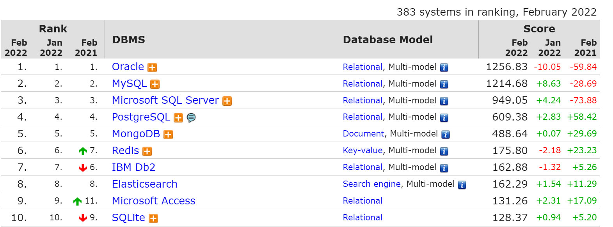

## Chapter 01. Introduction

Real MySQL 8.0 1장 소개 내용을 정리하였습니다.

---

### 1.1 MySQL 소개

- MySQL은 소스가 공개된 오픈소스 데이터 베이스이다.
- 현재 Oracle에서 인수되었으나 라이센스에 큰 변화는 없음
- MySQL 8.0 버전부터는 상용 DBMS가 가진 기능들이 장착되기 시작
- 엔터프라이즈 에디션은 소스코드는 공개되지 않음
- 커뮤니티 에디션은 여전히 소스코드가 공개된 상태

 

### 1.2 왜 MySQL인가?

- 비용
    - 코어 뱅킹 시스템은 아닐지라도 뱅킹 시스템에서 MySQL 서버를 사용하는 추세

### \[ DBMS를 선택함에 있어 고려해야할 점 ]

1. 내가 가장 잘 활용할 수 있는 DBMS
2. 안정성
3. 성능과 기능
4. 커뮤니티와 인지도

\[ DB ranking ]
출처 : DB-Engines.com  / 2022년 02월 DBMS ranking

