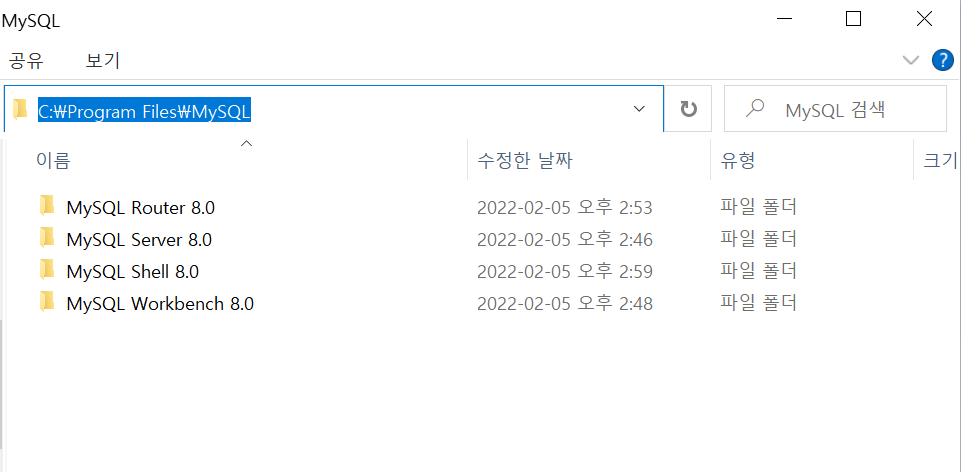

## Chapter 02. Installation and Settings

Real MySQL 8.0 2장 설치와 설정 내용을 실습하고 과정을 정리하였습니다.

---

### 2.1 MySQL 서버 설치

 

다음과 같이 여러 방식으로 설치가 가능하나, 리눅스의 RPM이나 OS별 인스톨러를 사용하기를 권장한다.

- Tar , Zip 형태의 압축된 버전
- 리눅스 RPM 설치
    - RPM(Redhat Package Manager) : 레드햇 계열의 리눅스 배포판에서 사용하는 프로그램(패키지) 설치 관리 도구
- 소스코드 빌드

 

### \[ 1 ] 버전 선택

MySQL 서버의 버전을 선택할 때는 다른 제약사항이 없다면, 최신버전을 선택하는 것이 좋지만 갓 출시된 메이저 버전은 버그가 발생할 수 있기 때문에 조금 위험할 수 있다.

 

### \[ 2 ] Windows용 installer 실행

- custom 옵션을 선택하여 MySQL Server, MySQL Router, MySQL Shell을 설치한다.

    - Router 설치 후 Configuration은 보류한다.

- 설치 완료 후 아래 경로에 폴더가 생성된 것을 확인

 

### MySQL 서버 디렉토리의 구조

- bin : MySQL 서버, 클라이언트, 유틸리티 프로그램
- include : C/C++ 헤더 파일
- lib : 라이브러리
- share : 에러 메세지나 설정 파일(my.ini)

 

### \[ 3 ] MySQL 서버 시작과 종료

MySQL Workbench를 통해 root 계정으로 접속

본 교재에서는 Linux를 통한 서버 시작과 종료 등을 기술하고 있다.

 

### \[ 4 ] 서버 설정

- MySQL 서버는 하나의 설정 파일을 사용하는데, 윈도우에서는 my.ini 이다.

    - MySQL 서버가 여러 개의 디렉토리를 순차적으로 탐색하여 발견된 첫번째 my.ini 파일을 사용

- Windows에서 MSI installer를 사용해 설치한 경우, my.ini파일은 PROGRAM DATA 폴더에 존재한다.
    - 확인 방법 : Win + R 실행창을 열어 services.msc 입력하여 서비스 목록에서 MySQL 관련 정보 확인

 

### [참고 사항]

- MySQL WorkBench가 아닌 명령 프롬프트를 통해 사용하기 위해서는 환경변수에 Path를 지정해주어야 한다.

 

 

