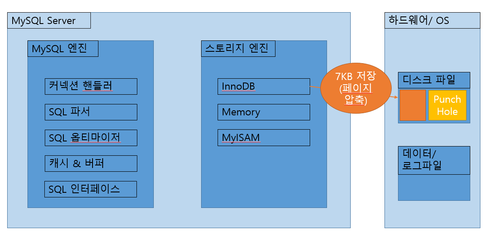

## Chapter 06 데이터 압축
</br>

---
## Introduction </br>

MySQL 서버 디스크의 데이터 파일 크기는 다음에 영향을 미친다.

1. 쿼리의 처리 성능
2. 백업 및 복구 시간
3. 저장 공간의 확보 - 비용
</br>

위 문제를 해결하기 위해 데이터 압축 기능을 제공

데이터 압축 방식
1. 페이지 압축
2. 테이블 압축
</br>

---

### 6.1 페이지 압축
- Transparent Page Compression
```sequence
SQL Server->디스크: 데이터 페이지 압축 저장
디스크->SQL Server: 압축 해제하여 읽기
```
- InnoDB의 버퍼 풀에 데이터 페이지가 한 번 저장되면 스토리지 엔진은 압축이 해제된 상태로만 데이터 페이지를 관리 (MySQL Server 내부 코드는 압축 여부와 관계없이 Transparent 하게 작동)

- 펀치 홀(Punch Hole) : 디스크에 사용할 파일 블럭을 미리 할당받는 기능

</br>

### \[ 페이지 압축 과정]
</br>
16KB의 페이지를 7KB로 압축하면 나머지 9KB의 펀치 홀이 생성되고 이를 OS에 반납한다.

</br>



</br>

- 문제점 1 : 하나의 테이블은 동일한 크기의 페이(블럭)으로 통일되어야 한다.

- 문제점 2 : OS별 특정 버전의 파일 시스템만 펀치홀이 지원

- 문제점 3 : 하드웨어의 펀치홀 요구사항 추가

→ 위 문제점들로 페이지 압축은 잘 사용되지 않는다.

```sql
-- 테이블 생성 시 페이지 압축 이용
mysql> CREATE TABLE test1 (c1 INT) COMPRESSION="zlib";

-- 테이블 변경 시 페이지 압축 이용
mysql> ALTER TABLE test1 COMPRESSION="zlib";
```

---

### 6.2 테이블 압축

### \[ 테이블 압축 과정 ]

테이블 압축 과정에는 다음 3가지 과정을 거친다.

1. 압축 테이블 생성

- 테이블 압축을 사용하기 위한 전제 조건

    → 별도의 테이블 스페이스를 사용

```sql
/* 
별도의 테이블 스페이스를 사용하기 위해
시스템 변수 innodb_file_per_table 을 ON으로 설정
*/

mysql> SET GLOBAL innodb_file_per_table=ON;

-- 테이블 생성 시 ROW_FORMAT, KEY_BLOCK_SIZE 옵션 사용하기
mysql> CREATE TABLE compressed_table (
        c1 INT PRIMARY KEY
       )
       ROW_FORMAT=COMPRESSED    -- ROW_FORMAT 옵션 생략 가능
       KEY_BLOCK_SIZE=8;        -- 단위는 KB
```


2. KEY_BLOCK_SIZE 결정
   - KEY_BLOCK_SIZE : 압축된 페이지가 저장될 크기를 지정</br>
        → 압축된 결과 목표 크기가 잘못 설정되면 MySQL 서버 처리 성능에 문제가 되므로 테이블 압축에서 가장 중요한 부분이다.


    


3. 압축 페이지의 버퍼 풀 적재 및 사용